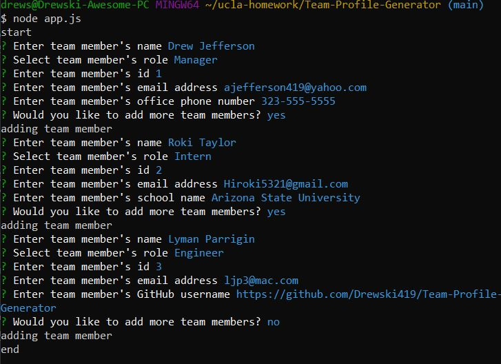
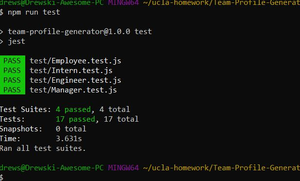
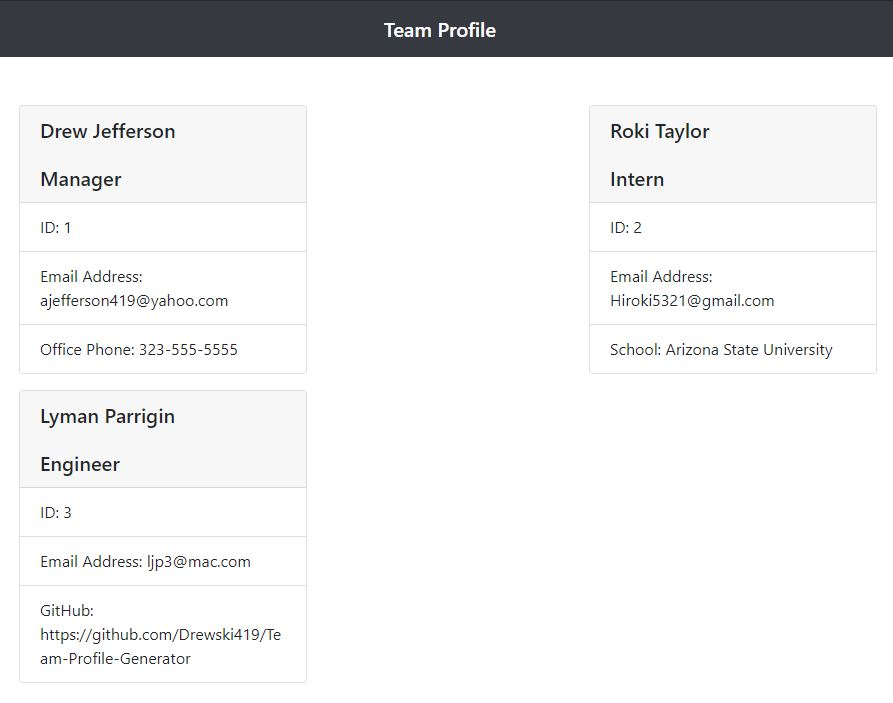

# Team Profile Generator

## User Story

```
As a manager
I want to generate a webpage that displays my team's basic info
so that I have quick access to emails and GitHub profiles
```

## Descripton

The Team Profile Generator is a command-line application that runs on Node.  It requests information from each user in order to run a file of the engineering team by generating an HTML file. Before running the application the user must perform an npm install to install all required dependencies.

Upon launching the app, the user is asked to describe the first member of their team. The user enters the team member's name, selects that member's role from a list (options include "Engineer," "Intern," and "Manager), enters the member's ID, enters the member's email address, and then must enter another piece of information that will differ depending on what role was selected. 

Screenshots below showing examples of user input and the text pass confirmation:






Once all information is input, an HTML file is created with cards displayhing the information on all team members.  The "team.html" file is located inthe "output" folder. A screenshot of an example team profile is shown below:




## Technology Used

NPM install
Inquirer package
Jest (for testing purposes)
FS
Javascript w/ HTML
Bootstrap
Node.js

## Links to File

[External link to Profile Generator](https://github.com/Drewski419/Team-Profile-Generator)

[Internal link to Profile Generator](https://drewski419.github.io/Team-Profile-Generator/)


